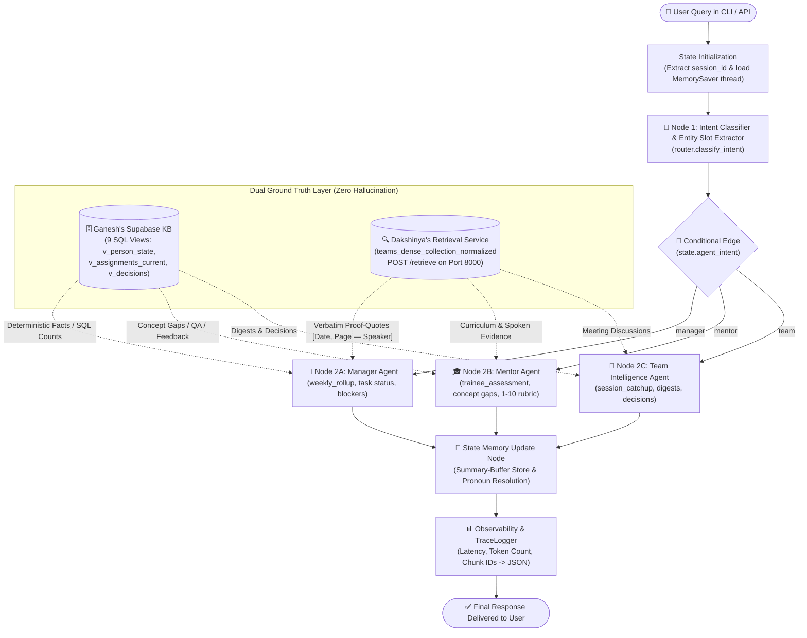

# 🧠 LangGraph Multi-Agent Orchestration Architecture

This document details the **LangGraph Orchestration Engine** (`graph.py`), state transitions, dynamic memory management, and dual ground-truth integration for the Enterprise RAG System.

---

## 🗺️ 1. End-to-End Orchestration Workflow (StateGraph)



---

## 📋 2. Strongly-Typed AgentState Schema

Every node in the graph consumes and returns the typed state (`AgentState`):

```python
class AgentState(TypedDict):
    # User Input & Entity Slots
    query: str
    session_id: str
    trainee: Optional[str]              # e.g., "Ganesh Krishna", "Himaya Perumal"
    date: Optional[str]                 # e.g., "2026-08-17"
    period: Optional[str]               # e.g., "week_1", "last_week"
    focus_area: Optional[str]           # e.g., "routing", "langgraph", "qdrant"
    strategy: Optional[str]             # e.g., "exp4", "exp2", "exp1"

    # Dynamic Routing Output
    agent_intent: str                   # "manager" | "mentor" | "team"

    # Execution & Observability Metadata
    final_response: str
    dispatched_agent: str
    latency_seconds: float
    trace_id: str

    # Conversational Memory
    conversation_history: List[Dict[str, str]]   # Verbatim last 4 exchanges
    conversation_summary: str                    # Compact rolling summary of older turns
```

---

## 🔀 3. Conditional Routing & Strategy Selection

| Target Agent | Trigger Criteria / Queries | Assigned Retrieval Strategy | Injected Supabase KB Views |
| :--- | :--- | :---: | :--- |
| **Manager Agent** | Weekly status, trainee deliverable progress, active blockers, chronological summaries | `exp4` (`top_k=40`) | `v_person_state`<br>`v_assignments_current`<br>`v_decisions` |
| **Mentor Agent** | Trainee concept gaps, misconceptions, 1–10 rubric evaluation, pedagogical coaching | `exp2` / `exp3` (`top_k=30`) | `v_concepts`<br>`v_qa`<br>`v_feedback` |
| **Team Agent** | Missed meeting catchup, architectural decisions, action items, session digests | `exp1` (`top_k=20`) | `v_digests`<br>`v_decisions` |

---

## 🧠 4. Summary-Buffer Conversational Memory

To prevent context bloat while supporting seamless multi-turn conversations:

```
[ User Dialogue Turns: 1, 2, 3, 4, 5, 6, 7, 8, ... ]
  │
  ├──► Turns 1–4 (Older turns) ─────► Rolling Summary: "[Earlier Context]: User asked about Himaya's architecture..."
  │
  └──► Turns 5–8 (Recent 4 exchanges) ─► Verbatim Dialogue Buffer (Exact speech kept for pronoun resolution)
```

* **Pronoun Resolution:** When a user asks *"How is Himaya doing?"* followed by *"What were his blockers?"*, the buffer resolves `"his"` ➔ `"Himaya Perumal"` automatically.
* **Context Switching:** If the user immediately asks *"What about Dakshinya?"*, slot priority updates the `trainee` entity slot to `"Dakshinya Nachimuthu"`, preventing stale state bleed.

---

## 🛡️ 5. Anti-Hallucination Guardrails & Fail-Safes

1. **Deterministic Ground Truth (Supabase):** Exact task counts and dates are never guessed by the LLM; they are passed directly from SQL query results.
2. **Mandatory Citations (Qdrant):** Every transcript quote must strictly follow `[Date, Page — Speaker]`.
3. **Loud Failure (`INSUFFICIENT_EVIDENCE`):** If a query asks about topics outside the training curriculum (e.g. AWS Kubernetes), the agent cleanly refuses to answer rather than hallucinating.

---

## 🎙️ 6. 1-Minute Pitch Script for Siddharth / Team

> *"Our orchestration is built as a **LangGraph StateGraph** featuring dynamic conditional routing. When a query enters the system, the **Intent Classifier** extracts entity slots (trainee name, dates, focus topics) and dispatches the task to the designated agent (Manager, Mentor, or Team). 
>
> Each agent combines **deterministic SQL facts from Ganesh's Supabase database** with **verbatim proof-quotes from Dakshinya's Qdrant vector retrieval**. 
>
> To support multi-turn conversations efficiently, we implemented a **Summary-Buffer Memory** that retains the last 4 exchanges verbatim for instant pronoun resolution while summarizing older turns. Every execution is tracked with JSON traces recording latency, token consumption, and chunk IDs."*
