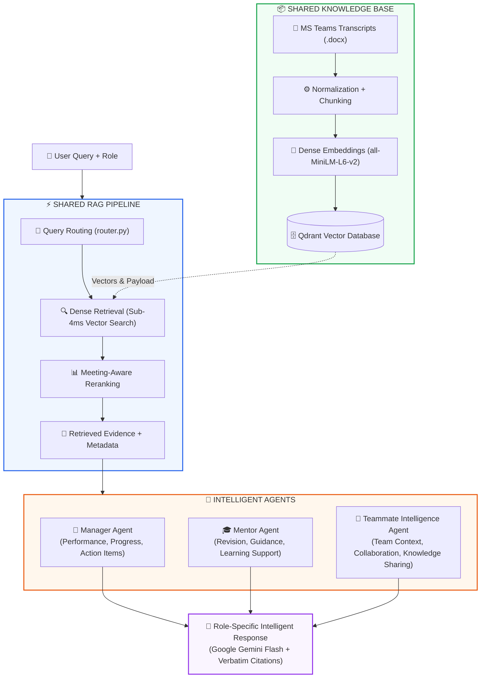

# Multi-Agent Teams Transcript RAG System

An enterprise-grade, privacy-first Retrieval-Augmented Generation (RAG) multi-agent system designed to parse, index, search, and synthesize Microsoft Teams meeting transcripts (`.docx`) with verbatim grounding and source citations.

---

## 🏗️ System Architecture



```text
  ┌───────────────────────┐
  │   👤 User Query + Role │
  └───────────┬───────────┘
              │
  ┌───────────▼───────────────────────────────────────────────────────────────────┐
  │ ⚡ SHARED RAG PIPELINE                                                         │
  │   ├── 🔀 Query Routing (router.py)                                            │
  │   ├── 🔍 Dense Retrieval (Sub-4ms Qdrant Vector Search) ◀── [🗄️ Qdrant DB]    │
  │   ├── 📊 Meeting-Aware Cross-Turn Reranking                                  │
  │   └── 📑 Retrieved Evidence + Metadata                                       │
  └───────────┬───────────────────────────────────────────────────────────────────┘
              │
  ┌───────────▼───────────────────────────────────────────────────────────────────┐
  │ 🤖 INTELLIGENT AGENTS                                                         │
  │   ├── 💼 Manager Agent               (Performance, Progress, Action Items)    │
  │   ├── 🎓 Mentor Agent                (Revision, Guidance, Learning Support)   │
  │   └── 👥 Teammate Intelligence Agent (Team Context, Knowledge Sharing)        │
  └───────────┬───────────────────────────────────────────────────────────────────┘
              │
  ┌───────────▼───────────────────────────────────────────────────────────────────┐
  │ 💬 Role-Specific Intelligent Response (Google Gemini Flash + Verbatim Proof)   │
  └───────────────────────────────────────────────────────────────────────────────┘
```

---

## 🧩 Architectural Breakdown

### 1. 📦 Shared Knowledge Base
* **MS Teams Transcripts**: Ingests all training meeting transcripts (`.docx`) spanning project kickoff to final deliverables.
* **Normalization + Chunking**: Pre-chunking speaker normalization, crosstalk resolution, transcription noise removal, and semantic topic-shift boundary chunking.
* **Dense Embeddings & Caching**: Sentence-Transformers (`all-MiniLM-L6-v2`) generating 384-dimensional dense vectors with local persistent SHA-256 caching (`emb_cache`).
* **Qdrant Vector Database**: Embedded and file-backed vector database storing dense vectors with rich payload metadata (Date, Speaker, Page Number, Chunk ID).

---

### 2. ⚡ Shared RAG Pipeline
* **Query Routing (`router.py`)**: Directs incoming requests based on user role and natural language intent (Manager vs. Mentor vs. Teammate queries).
* **Dense Retrieval (`pipeline.py`)**: Executes 4 optimized retrieval pipelines (P1: Baseline, P2: Filtered, P3: Reranked, P4: Full-Corpus Map-Reduce).
* **Reranking**: Recency- and relevance-weighted reranker prioritizing actionable meeting moments over generic chatter.
* **Retrieved Evidence + Metadata**: Bundles verified context blocks with exact transcript citations.

---

### 3. 🤖 Intelligent Agents
* **💼 Manager Agent (`agents/manager_agent.py`)**:
  * Serves Executive Role (**Iyappan Sir**).
  * Synthesizes deliverable progress tables, active blockers, decision logs, and milestone timelines.
* **🎓 Mentor Agent (`agents/mentor_agent.py`)**:
  * Serves Mentor Role (**Siddharth Saminathan**).
  * Generates mentee technical scorecards, technical quizzes, learning topic assignments, and targeted coaching notes.
* **👥 Teammate Intelligence Agent (`agents/teammates_agent.py`)**:
  * Serves Teammates (**Himaya Perumal**, **Ganesh Krishna**, **Dakshinya Nachimuthu**).
  * Explains system architecture, code implementations, and retrieves verbatim spoken discussion turns.

---

### 4. 💬 Role-Specific Intelligent Response
* **LLM Engine**: **Google Gemini Flash (`gemini-2.5-flash`)** as primary generation engine with automated fallback to Groq.
* **Verbatim Grounding**: Every fact, table entry, and score is verified against source citations (`[Date — Page — Speaker]`).
* **Clean Formatting**: Enforces single-header Markdown tables and sanitizes pipe characters to ensure perfect table rendering.

---

## 🚀 Quick Start & Usage

### 1. Environment Setup
Create a `.env` file in the root directory:
```env
# Primary LLM Provider
GEMINI_API_KEY="your_google_gemini_api_key"
GEMINI_MODEL_NAME=gemini-2.5-flash
GEMINI_TEMPERATURE=0.2
GEMINI_TOP_P=0.9
GEMINI_MAX_TOKENS=4096

# Backup Providers (Optional)
GROQ_API_KEY="your_groq_api_key"
OPENROUTER_API_KEY="your_openrouter_api_key"
GITHUB_TOKEN="your_github_token"
```

Install dependencies:
```powershell
pip install -r requirements.txt
```

---

### 2. Launch the Web Application Dashboard
Start the production FastAPI server:
```powershell
python api_server.py
```
Open your browser at **`http://127.0.0.1:8000`** to access the interactive web dashboard with:
* Real-time Role Switcher (Owner, Manager, Mentor, Teammates)
* Dark / Light mode toggle
* Live LLM Provider and Latency status badges
* Markdown and table rendering with verbatim citation proofs

---

### 3. FastMCP Server (For IDE & External Agent Integration)
Run the standard FastMCP server over STDIO:
```powershell
python mcp_server.py --server
```

Exposes 5 MCP tools:
* `mcp_search_transcripts`: Authenticated Qdrant vector search
* `manager_agent_tool`: Executive status, blockers, and deliverables
* `mentor_agent_tool`: Mentee scorecards and coaching guidance
* `teammates_agent_tool`: Codebase SCQA and discussion retrieval
* `router_dispatch_tool`: Automated central intent dispatcher

---

### 4. Automatic Transcript Watcher Daemon
Monitor your Windows `Downloads` folder for newly downloaded Teams transcripts:
```powershell
python auto_folder_watcher.py
```

---

## 📁 Repository Structure

```text
RAG_COMBINED/
├── agents/
│   ├── manager_agent.py        # Executive Manager Agent
│   ├── mentor_agent.py         # Mentee Evaluation & Learning Agent
│   └── teammates_agent.py      # Codebase Assistant & Quote Retrieval
├── static/
│   ├── index.html              # Modern Web Dashboard
│   ├── styles.css              # Glassmorphism design & responsive layout
│   └── script.js               # Frontend controller & citation renderer
├── skills/                     # Skill prompt templates & definitions
├── api_server.py               # Production FastAPI REST Backend
├── router.py                   # Central Intent & Role-Based Prompt Router
├── pipeline.py                 # Vector DB, Chunking, Cache, & 4 Retrieval Pipelines
├── prompt_builder.py           # 8-Module dynamic System Prompt Builder
├── llm_client.py               # Google Gemini (gemini-2.5-flash) primary LLM Engine
├── github_mcp_client.py        # GitHub MCP Client (Issues, PRs, Commits, Diffs)
├── mcp_server.py               # FastMCP Server with Auth Layer
├── auto_folder_watcher.py      # Automatic incremental transcript download watcher
├── requirements.txt            # Python dependencies
├── README.md                   # System architecture & documentation
└── .env                        # Local environment credentials (git-ignored)
```
