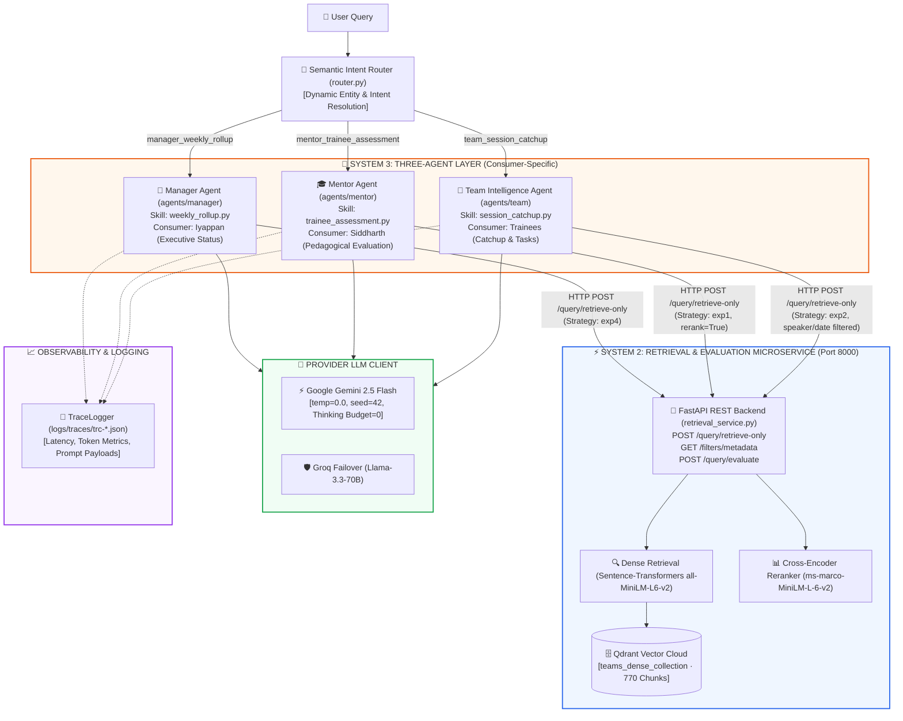

# Multi-Agent Teams Transcript RAG System (Enterprise Specification)

An enterprise-grade, privacy-first Retrieval-Augmented Generation (RAG) multi-agent system designed to parse, index, search, and synthesize Microsoft Teams meeting transcripts (`.docx`) with verbatim grounding, exact citations, and zero hardcoding.

---

## 🏗️ System Architecture

The system operates across a clean, decoupled **Two-Tier Microservice Architecture**:



---

## 🧩 Key Architectural Principles

### 1. 🌐 Decoupled Microservice Layering
* **System 2 (Retrieval Microservice)** runs as an independent FastAPI service on `http://127.0.0.1:8000`.
* **System 3 (Agent Layer)** performs **zero local vector queries**. All vector retrieval and reranking are fetched exclusively over authenticated HTTP endpoints (`/query/retrieve-only`).

### 2. 🛡️ Zero Hardcoded Entities or Rules
* **No Hardcoded Trainee Lists**: Trainees (`Himaya Perumal`, `Ganesh Krishna`, `Dakshinya Nachimuthu`) and valid session dates are dynamically discovered at runtime via `GET /filters/metadata` directly from Qdrant.
* **No Rigid Keyword Routing**: `router.py` uses semantic intent classification with dynamic entity matching.

### 3. 🎯 Strict Cognitive Guardrails
* **Taught ≠ Understood**: Trainees are only credited when they have actively written code, built tools, or defended solutions—not simply because the mentor discussed the topic.
* **Barbara Minto's Pyramid Principle**: Evaluative outputs strictly lead with a `### GOVERNING THOUGHT`, followed by numbered `### KEY ARGUMENTS`, a deterministic `### SCORES TABLE`, and `### PEDAGOGICAL RECOMMENDATIONS`.
* **Deterministic Scoring (1–10 Rubric)**: Mentor evaluations enforce a strict 1–10 rubric scale at `temperature=0.0` with `seed=42` to guarantee 100% reproducible, frozen scores across repeated runs.
* **Mandatory Verbatim Citations**: Every single technical claim requires an exact source citation `[Date, Page — Speaker]`.
* **Loud Failure Boundary**: If evidence is missing, the system outputs `INSUFFICIENT_EVIDENCE` instead of hallucinating.

---

## 👥 Three Specialized Agent Personas

| Agent | Target Consumer | Primary Skill | Output Format |
| :--- | :--- | :--- | :--- |
| **Manager Agent** | **Iyappan** (Executive Engineering Manager) | `manager_weekly_rollup` | `Executive conclusion`, `Completed (with quotes & citations)`, `In Progress`, `Blocked or At Risk` |
| **Mentor Agent** | **Siddharth** (AI Architect & Mentor) | `mentor_trainee_assessment` | Minto Pyramid Principle (`Governing Thought`, `Key Arguments 1..3`, `Scores Table (1-10)`, `Pedagogical Next Steps`) |
| **Team Intelligence Agent** | **Trainees** (Himaya, Ganesh, Dakshinya) | `team_session_catchup` | Single-Session Recap (`Technical Decisions`, `Assigned Tasks per Trainee`, `Team-Wide Actions`) |

---

## 🚀 Quick Start & Execution

### 1. Prerequisites & Environment Setup
Create a `.env` file in the root directory:
```env
GEMINI_API_KEY="your_gemini_api_key"
GEMINI_MODEL_NAME="gemini-2.5-flash"
GEMINI_TEMPERATURE="0.0"
GEMINI_MAX_TOKENS="8192"
GROQ_API_KEY="your_groq_api_key"
QDRANT_URL="your_qdrant_cloud_url"
QDRANT_API_KEY="your_qdrant_api_key"
```

Install dependencies:
```powershell
pip install -r requirements.txt
```

---

### 2. Start the Backend Services

#### Terminal 1: Launch Retrieval Service (System 2)
```powershell
python retrieval_service.py
```
*Live on `http://127.0.0.1:8000` with endpoints `/filters/metadata`, `/query/retrieve-only`, and `/query/evaluate`.*

#### Terminal 2: Run Interactive CLI (System 3)
```powershell
python cli.py
```

---

## 🧪 Example Test Queries

### 👔 Manager Agent Queries
```text
> What are the major deliverables completed across the entire team so far?
> List all the active technical blockers and open decisions currently at risk.
> What architectural and tooling changes occurred during the training?
```

### 🎓 Mentor Agent Queries
```text
> Give me a pyramid principle breakdown of the entire cohort's performance.
> How did Himaya perform during the training? What are her key strengths and knowledge gaps?
> What did Siddharth teach regarding caching, embeddings, and context window limits?
```

### 👥 Team Intelligence Agent Queries
```text
> I missed the session on July 28, catch me up on what happened.
> What decisions and action items were agreed upon in the July 21 meeting?
> I was absent on July 24. What specific tasks were assigned to Ganesh?
```

---

## 📁 Repository Structure

```text
RAG_COMBINED/
├── agents/
│   ├── manager/
│   │   ├── agent.py            # Manager Agent Class
│   │   └── skills/
│   │       └── weekly_rollup.py # Executive Rollup & Deliverables Skill
│   ├── mentor/
│   │   ├── agent.py            # Mentor Agent Class
│   │   └── skills/
│   │       └── trainee_assessment.py # Trainee Evaluation & Pyramid Principle Skill
│   ├── team/
│   │   ├── agent.py            # Team Intelligence Agent Class
│   │   └── skills/
│   │       └── session_catchup.py # Meeting Catchup & Task Assignment Skill
│   └── shared/
│       ├── retrieval_client.py # HTTP Client for S2 API (port 8000)
│       ├── llm_client.py       # Google Gemini Flash + Groq Failover Client
│       ├── logger.py           # JSON Trace Logger (logs/traces/)
│       └── models.py           # Shared Pydantic Models & Schemas
├── retrieval_service.py        # Dakshinya's FastAPI Microservice (Port 8000)
├── router.py                   # Central Semantic Intent & Entity Router
├── cli.py                      # Interactive CLI Interface with Live Tracing
├── transcript_normalizer.py    # Transcript Cleaner & Chunk Normalizer
├── transcript_utils.py         # Metadata Extractor & Session Parser
├── auto_folder_watcher.py      # Background Transcripts Ingestion Watcher
├── requirements.txt            # Python Dependencies
├── README.md                   # System Documentation
└── .env                        # Environment Configuration
```

---

## 📊 Observability & Verification

Every agent execution automatically creates a trace log in `logs/traces/trc-<id>.json` recording:
* **Trace ID & Timestamp**
* **Agent Persona & Skill Executed**
* **Retrieval Strategy & Evidence Chunk Count**
* **LLM Model Name, Prompt Tokens & Completion Tokens**
* **Total Execution Latency**
* **Full Prompt & Output Payloads**
