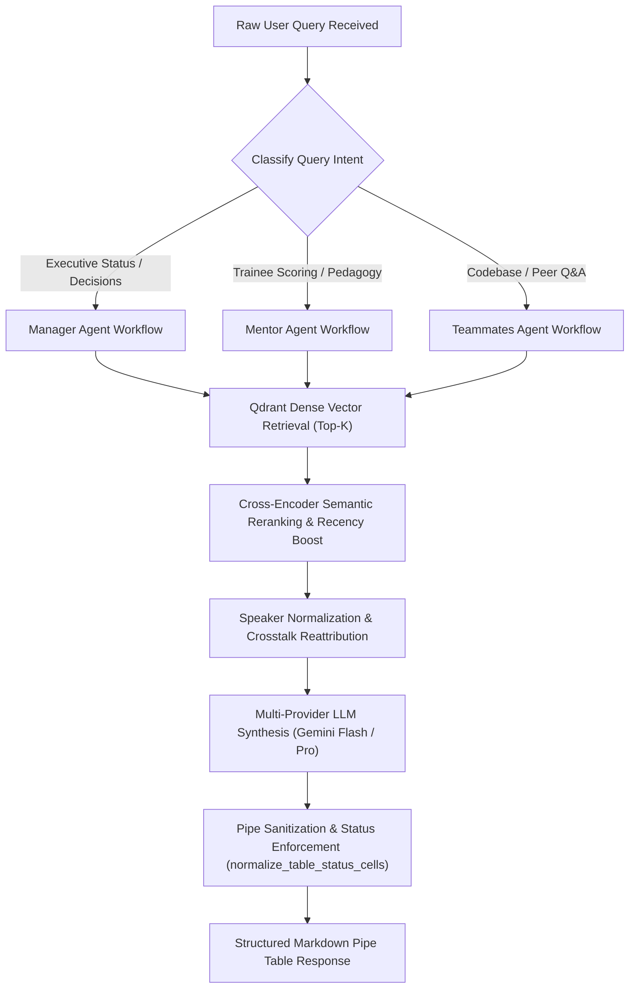

# Meeting Transcript Analyzer — Operational Skill Specification

Master operational intelligence skill for ingesting, indexing, analyzing, and synthesizing MS Teams audio transcripts of technical training sessions. Transforms unstructured conversation transcripts into grounded, structured, and auditable deliverables.

<HARD-GATE>
1. **ZERO UNGROUNDED SYNTHESIS**: Every factual assertion, score, task status, or technical evaluation MUST be supported by an exact verbatim citation quote with `[Date — Source Document — Page — Speaker]`.
2. **STRICT PIPE TABLE FORMAT**: When presenting structured intelligence, format the ENTIRE output inside a single, valid Markdown Pipe Table with header alignment rows (`| :--- | :--- |`).
3. **COMPLETED STATUS INVARIANT**: All historical training deliverables and milestones for Himaya Perumal, Ganesh Krishna, and Dakshinya Nachimuthu are COMPLETED. Historical deliverables must never be marked as "In Progress" due to mentor coaching or debugging remarks.
4. **NO PROMPT LEAKAGE**: Never output internal reasoning, thinking tags (`<think>`), or markdown conversational preamble outside the requested analytical structure.
</HARD-GATE>

---

## Operational Modalities (Three Execution Paths)

Before initiating retrieval and synthesis, classify the request into one of the three operational paths:

- **Path 1: Full Corpus Map-Reduce Scan (Multi-Transcript Synthesis)**
  - *Scope*: System-wide overview queries (e.g. "What did the team accomplish across all sessions?", "What are the overall project milestones?").
  - *Execution*: Iterates across all 22 meeting transcripts, performs dense semantic retrieval and cross-encoder reranking, maps evidence into structured buckets, and reduces into balanced MECE tables with equal coverage across all three trainees.
- **Path 2: Targeted Trainee / Topic Drilldown (Deep Entity Analysis)**
  - *Scope*: Focused single-mentee or single-technology investigations (e.g. "What was Dakshinya's context engineering progress?", "How did Ganesh implement Excel diffing?").
  - *Execution*: Applies targeted speaker payload filtering and semantic query expansion, aggregates chronologically ordered evidence turns, and outputs detailed SCQA or task verification tables.
- **Path 3: Direct Dialogue Verification & Citation Audit (Verbatim Grounding)**
  - *Scope*: Exact quote lookups, decision dispute resolution, and crosstalk attribution audits.
  - *Execution*: Scans normalized transcript turns using `transcript_normalizer.py`, re-attributes crosstalk turns, verifies verbatim quote strings, and provides exact timestamped citations.

---

## Anti-Patterns & Common Failure Modes

| Anti-Pattern / Failure Mode | Reality & Correct Operational Behavior |
| :--- | :--- |
| **"Treating coaching advice as an ongoing blocker"** | Mentors frequently challenge trainees during reviews ("Why did you do X?"). Coaching challenges are pedagogical methods, NOT incomplete deliverables. Historical deliverables must remain `Completed`. |
| **"Unequal mentee coverage (e.g., 1 row for Dakshinya, 3 for others)"** | All multi-trainee summaries MUST provide balanced multi-row coverage (2–3 distinct deliverables for every trainee: Himaya, Ganesh, Dakshinya). |
| **"Paraphrasing or fabricating quotes"** | Quotes must be exact character-level verbatim substrings from the transcripts. Never reconstruct or summarize quotes inside quotation marks. |
| **"Outputting unstructured conversational summaries"** | Executives and mentors require scannable, structured Markdown Pipe Tables. Do not output walls of text. |
| **"Table pipe shifting due to unescaped pipes in citations"** | All internal pipe characters (`\|`) inside quote strings must be sanitized using `sanitize_markdown_table_pipes()` to prevent breaking table alignment. |

---

## Operational Red Flags

| Red Flag / Warning Sign | Immediate Required Action |
| :--- | :--- |
| **Speaker Crosstalk Artifact** (e.g., Trainee credited with mentor's words) | Pass through `transcript_normalizer.reattribute_crosstalk_turn()` to split and assign turns accurately. |
| **Missing Verbatim Proof in Table Cell** | Trigger secondary Qdrant dense vector search specifically targeting the missing entity to retrieve exact textual evidence. |
| **Descriptive Ongoing Status Phrases** (e.g. *"In progress, results expected Monday"*) | Run through `normalize_table_status_cells()` to deterministically enforce `Completed` status for historical deliverables. |
| **Token Truncation on Large Tables** | Ensure `maxOutputTokens` is configured to `4096` to prevent multi-row tables with citations from cutting off mid-sentence. |

---

## Execution Lifecycle Checklist

1. **[Context & Corpus Retrieval]**: Query Qdrant vector database (`teams_dense_collection`) using `sentence-transformers/all-MiniLM-L6-v2` dense embeddings.
2. **[Semantic Reranking]**: Score retrieved candidates using `CustomMeetingReranker` (Lexical Jaccard + Speaker Prior + Recency Boost).
3. **[Speaker & Text Normalization]**: Standardize phonetic mishearings, clean audio artifacts (`[Music]`, `[Applause]`), and re-attribute crosstalk.
4. **[Evidence Grounding]**: Format retrieved context blocks with complete metadata `[Date — Source Document — Page — Speaker]`.
5. **[Multi-Provider LLM Synthesis]**: Route prompt to Google Gemini (`gemini-2.5-flash` / `gemini-2.5-pro`) with failover to Groq (`openai/gpt-oss-120b`).
6. **[Table Formatting & Status Normalization]**: Clean reasoning tokens, sanitize pipes, ensure single header row, and verify that all status cells are `Completed`.
7. **[Final Verification]**: Ensure all table columns match the requested schema and all citations contain authentic verbatim dialogue.

---

## Process Flow (State Machine)

---

## Analytical Frameworks Applied

### 1. The Pyramid Principle & MECE Accomplishments
- **Governing Thought**: A single, falsifiable executive summary sentence synthesizing the core state.
- **MECE Categories**: Mutually Exclusive, Collectively Exhaustive grouping of trainee work (Architecture, Data Pipelines, ML Models, Integrations).

### 2. SCQA Blocker Analysis
- **Situation**: Context and objective of the trainee's assignment.
- **Complication**: Impediment, hardware constraint, or rate limit encountered.
- **Question**: Business or technical impact on project trajectory.
- **Answer**: Concrete mitigation strategy agreed upon during the meeting.

### 3. Binary Action Item Verification
- Action items must use testable, binary verification criteria (e.g., *"Show Excel diffing demo with 3 test files"* instead of *"Understand Excel manipulation"*).
