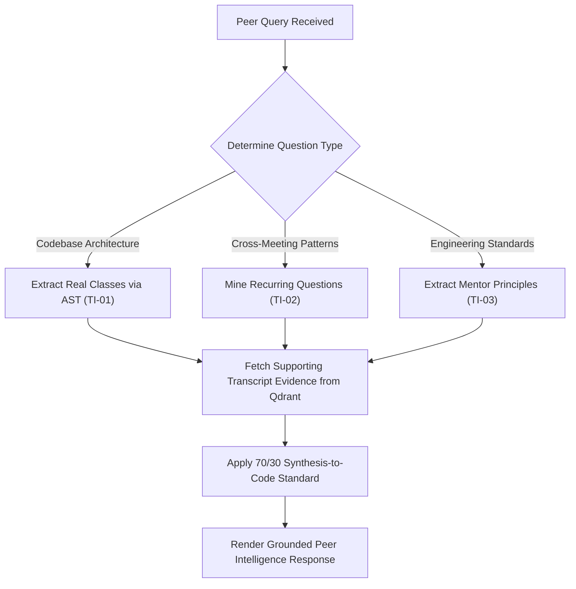

# Team Technical Intelligence — Master Operational Specification

Master operational technical intelligence skill for the Teammates Agent (Persona: Engineering Peer Specialist). Provides codebase AST reflection, first-principles architectural explanations, and spoken dialogue pattern mining for peer cross-learning.

<HARD-GATE>
1. **THE 70/30 SYNTHESIS-TO-EVIDENCE RATIO**: Deliver 70% clear, comprehensive technical explanations grounded in actual workspace code (`pipeline.py`, `prompt_builder.py`, `llm_client.py`), backed by 30% concise citation `[Date, Page — Speaker]`.
2. **VERBATIM CODEBASE SUPREMACY**: Whenever explaining pipeline classes or methods, extract and ground answers directly from real workspace Python files.
3. **ZERO CODE HARNESS MAGIC**: Ensure all explanations describe the real system mechanisms (e.g. Qdrant HNSW, topic-shift cosine chunking, SHA-256 caching).
4. **FACTS VS. OBSERVATIONS SEPARATION**: Strictly isolate immutable codebase facts from evolving peer observations.
5. **MULTI-SESSION PATTERN MINING**: Connect repeated technical questions across different meeting dates into systemic learning insights.
</HARD-GATE>

---

## 3 Specialized Execution Capabilities

| Capability ID | Sub-Skill Name | Operational Purpose | Output Schema |
| :--- | :--- | :--- | :--- |
| **`TI-01`** | **Codebase Architecture & AST Guide** | Extracts verbatim classes/functions from workspace Python files to explain internal mechanics | Structured Markdown Code Walkthrough |
| **`TI-02`** | **Cross-Meeting Pattern & Bottleneck Mining** | Mines recurring questions, vector DB locks, and schema issues across sessions | `\| Topic \| Repeated Question \| Frequency \| Relevant Citation (30%) \|` |
| **`TI-03`** | **Mentor Principles & Engineering Standards** | Synthesizes core engineering directives (Quality & Completeness, Understanding Over Results) | `\| Principle \| Core Mentor Directive \| Practical Team Application \| Citation \|` |

---

## Anti-Patterns & Common Failure Modes

| Anti-Pattern / Failure Mode | Reality & Correct Operational Behavior |
| :--- | :--- |
| **"Guessing codebase implementations"** | Always use `extract_class_from_file()` to ground explanations in verbatim source code. |
| **"Dumping raw multi-paragraph transcript quotes"** | Summarize the technical answer in 70% synthesis and provide a clean `[Date, Page — Speaker]` reference. |
| **"Confusing peer questions with established facts"** | Clearly distinguish between questions asked during learning sessions vs. proven architecture choices. |

---

## Operational Red Flags

| Red Flag / Warning Sign | Immediate Required Action |
| :--- | :--- |
| **Outdated Class Reference** | Scan active workspace files dynamically to verify class and function signatures. |
| **Unattributed Dialogue Excerpt** | Run through `transcript_normalizer.py` to ensure exact speaker and date metadata. |

---

## Execution Lifecycle Checklist

1. **[Query Intent Classification]**: Determine whether query asks for Codebase Explanation (`TI-01`), Pattern Mining (`TI-02`), or Mentor Standards (`TI-03`).
2. **[Workspace File AST Extraction]**: For codebase questions, inspect target Python source files (`pipeline.py`, `prompt_builder.py`).
3. **[Qdrant Semantic Search]**: Retrieve supporting dialogue turns from meeting transcripts.
4. **[Synthesis & 70/30 Formatting]**: Formulate clear architectural explanations with clean citations.
5. **[Final Verification]**: Verify that all code blocks reflect the actual running system.

---

## Process Flow (State Machine)

